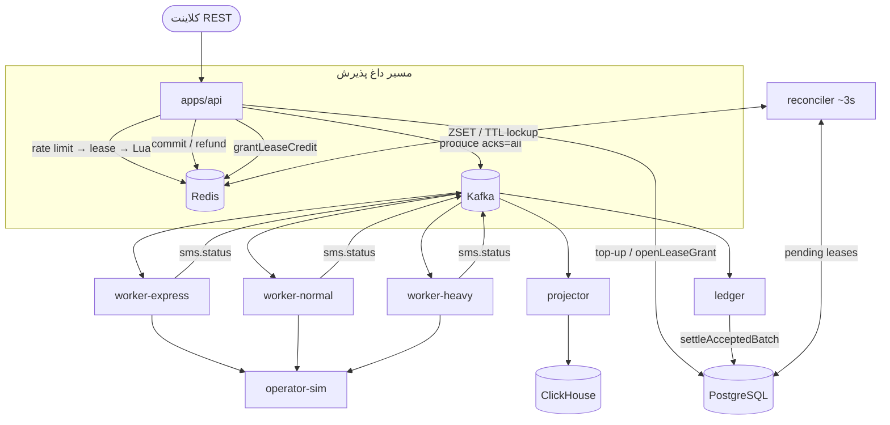
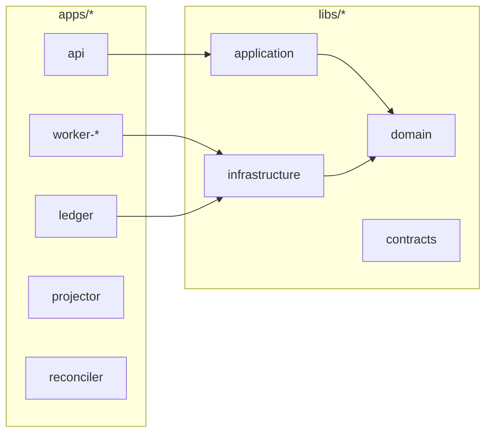
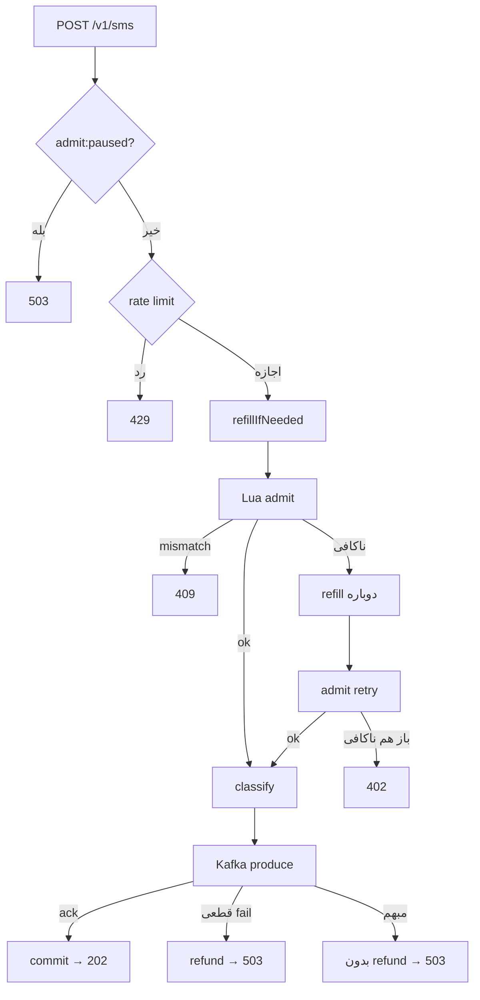
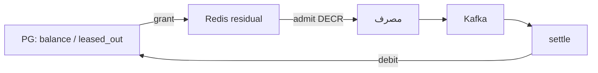

# معماری PulseGate

**سامانهٔ دروازهٔ پیامک توزیع‌شده** — نسخهٔ قابل‌تحویل چالش ابرآروان  
**پشته:** NestJS Monorepo · PostgreSQL · Redis (Lua) · Kafka · ClickHouse  
**هدف ظرفیت:** حدود ۱۰۰ میلیون پیامک در روز · ترافیک چندمستأجری ناعادلانه · Express با P99 &lt; ۵۰۰ms تا ack اپراتور  
**ناوردای سخت:** پس از اتمام اعتبار قابل‌خرج، هیچ پیامکی پذیرفته نمی‌شود.

نسخهٔ انگلیسی (خواناتر روی GitHub برای ارائه): [ARCHITECTURE.md](./ARCHITECTURE.md)

> **ترتیب پیشنهاد برای ارائه:** نمودار ۲ → ۴ → ۵ → ۶ → ۷

---

## ۱. خلاصهٔ اجرایی

مسیر کلاسیک «تراکنش Postgres به‌ازای هر پیام + Outbox» برای مقیاس ۱۰۰M/روز مناسب نیست. تصمیم اصلی:

| دغدغه | مالک |
|--------|------|
| پذیرش اعتبار (hot path) | Redis Lua روی اعتبار **اجاره داده‌شده** |
| انصاف | مسیر `sms.heavy` + فاصلهٔ ارسال per-tenant + سقف اضطراری `429` |
| ingest پایدار | Kafka با `acks=all` (همان تاپیک‌های dispatch) |
| مرجع مالی (SoR) | PostgreSQL — settle دسته‌ای از شمارش Kafka + offset در یک TX |
| تاریخچه / گزارش | فقط ClickHouse |
| ارسال به اپراتور | workerهای express / normal / heavy + retry + DLQ |

---

## ۲. نمودار کلی سیستم

---

## ۳. بسته‌بندی Monorepo

**apps = نحوهٔ اجرا · libs = معنای دامنه.**

| پورت دامنه | پیاده‌سازی |
|------------|------------|
| `CreditStore` | `redis-credit.store.ts` |
| `WalletRepository` | `typeorm-wallet.repository.ts` |
| `LeaseGrantService` | `default-lease-grant.service.ts` |
| `SmsProducer` | `kafka-sms.producer.ts` |
| `TrafficClassifier` | `redis-traffic.classifier.ts` |
| `RateLimiter` | `redis-rate-limiter.ts` |
| `SmsReportStore` | `clickhouse-sms-report.store.ts` |

---

## ۴. خط لولهٔ Admit (هم‌تراز با کد)

**اولین lease:** معمولاً روی top-up. روی SMS اگر residual کم باشد refill می‌شود؛ اگر admit اول insufficient باشد **یک‌بار دیگر** refill + retry.

---

## ۵. مسیر ارسال (Sequence)

نمودار کامل با Postgres در مسیر lease و retry admit:

→ بخش ۵ در [ARCHITECTURE.md](./ARCHITECTURE.md)

نکته: `LeaseGrant` با **Postgres** `openLeaseGrant` می‌زند، بعد `grantLeaseCredit` به Redis — نه self-call.

---

## ۶. اجارهٔ اعتبار

- سقف اجاره: `balance − leased_out` → اگر ledger عقب باشد **overspend نمی‌شود**.
- بازسازی محافظه‌کارانه: `npm run redis:rebuild`.

---

## ۷. تاپیک‌های Kafka

نمودار کامل consumer groupها: بخش ۷ در [ARCHITECTURE.md](./ARCHITECTURE.md).

خلاصه: `sms.express|normal|heavy` + retry/status/dlq — ledger و projector روی همان تاپیک‌های dispatch با CG جدا.

---

## ۸. انصاف و SLO

| سازوکار | نقش |
|---------|-----|
| classifier | tenant سنگین → `sms.heavy` |
| gap روی heavy | جلوگیری از starvation |
| rate limit قبل از Lua | سقف اضطراری `429` |

**SLO اکسپرس:** P99 از `accepted_at` تا ack اپراتور &lt; ۵۰۰ms (`latency_ms` در ClickHouse).

---

## ۹. فرایندهای پس‌زمینه

| فرایند | مدل بیدار شدن |
|--------|----------------|
| worker / projector | Kafka (رویدادمحور) |
| ledger | Kafka + flush حدود ۲ ثانیه |
| reconciler | تایمر حدود ۳ ثانیه؛ TTL روی PENDING فقط **commit/lockup** |

Kafka لوکال تک‌broker / RF=1 است؛ production باید multi-broker با RF≥3 باشد.

---

## ۱۰. محدودیت‌ها و اجرا

- Auth/UI خارج از محدودهٔ صورت تمرین.
- Bulk API عمداً نیست.
- اثبات بار: k6 محلی.
- متریک: `GET /v1/metrics`.

[README.md](../README.md) · [RUNBOOK.md](../RUNBOOK.md)

