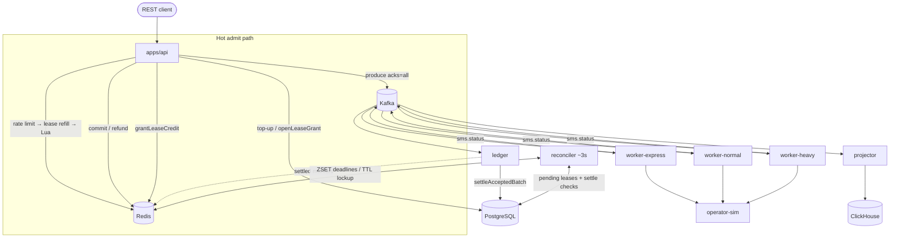
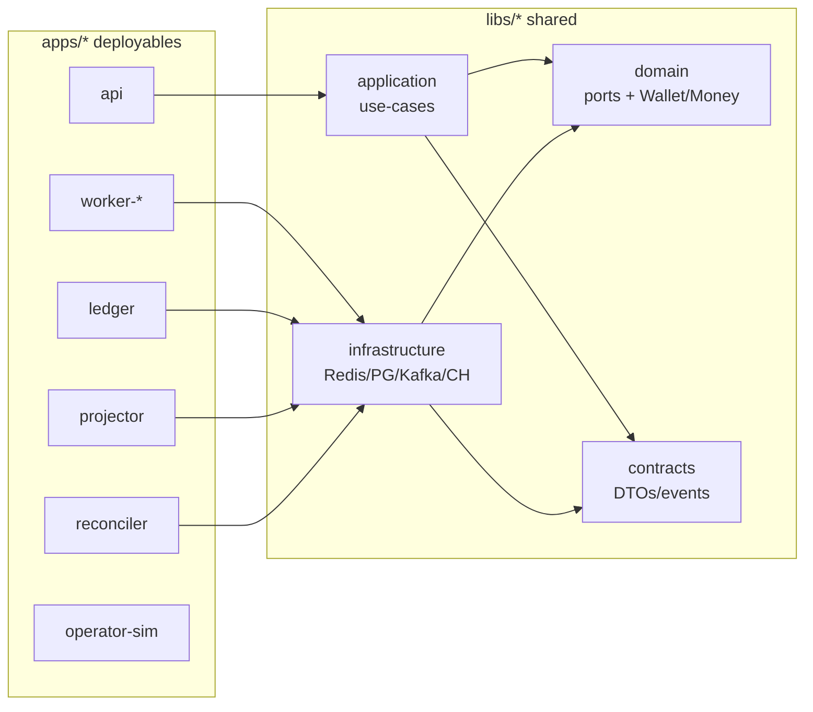
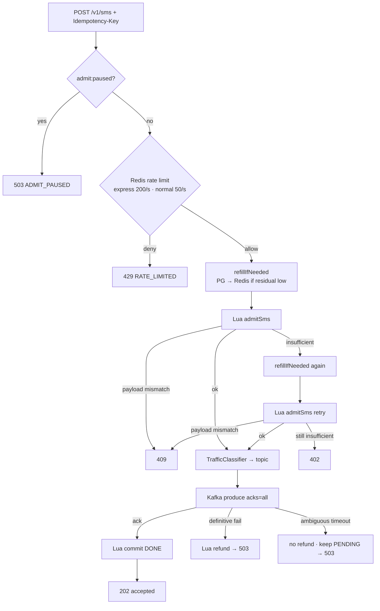
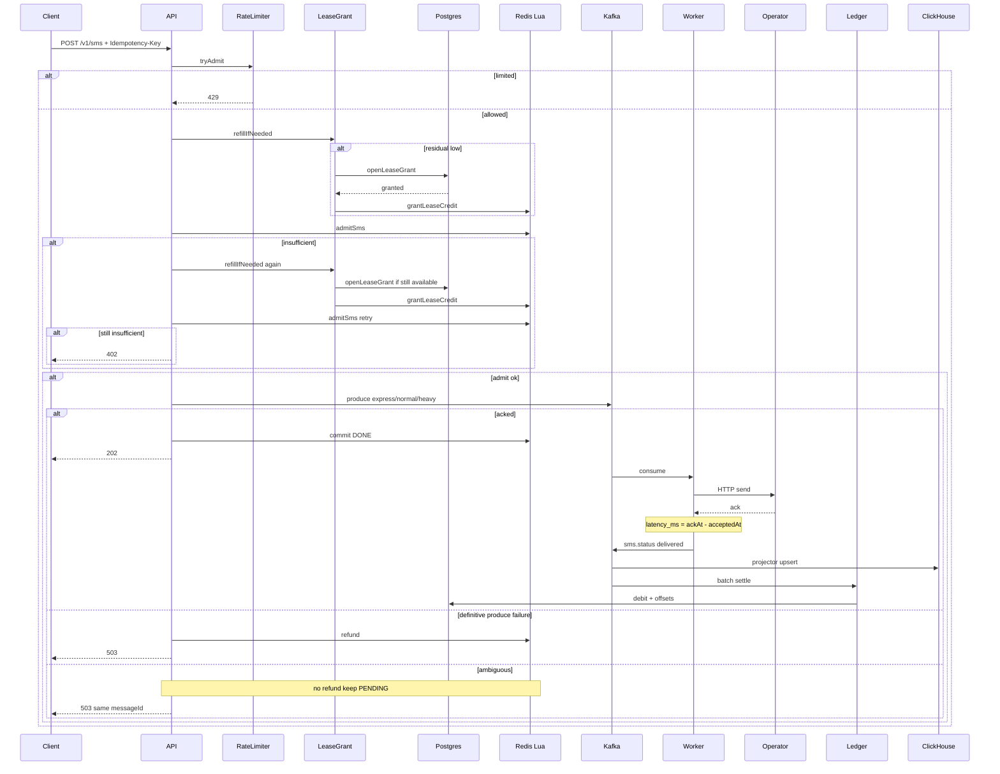
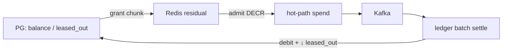
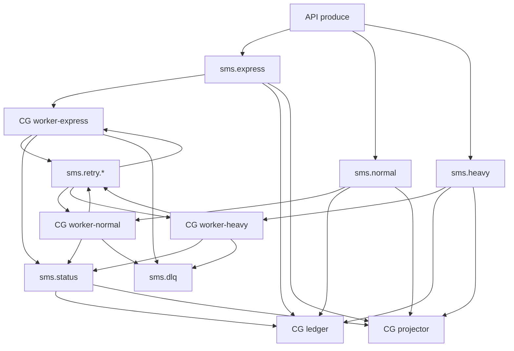

# PulseGate Architecture

**Distributed SMS Gateway** — deliverable for the ArvanCloud challenge  
**Stack:** NestJS monorepo · PostgreSQL · Redis (Lua) · Kafka · ClickHouse  
**Capacity target:** ~100M SMS/day · unfair multi-tenant traffic · Express P99 &lt; 500ms to operator ack  
**Hard invariant:** no SMS is accepted after spendable credit is exhausted.

Persian (RTL): [ARCHITECTURE.fa.md](./ARCHITECTURE.fa.md)

> **Presentation tip:** Walk diagrams in order **2 → 4 → 5 → 6 → 7**. Keep 3 for “why monorepo?” questions.

---

## 1. Executive summary

A classic per-SMS Postgres transaction + Outbox path cannot sustain ~100M/day. The locked design:

| Concern | Owner |
|---------|--------|
| Credit admission (hot path) | Redis Lua over **leased** residuals |
| Fairness | `sms.heavy` path + per-tenant dispatch gap + emergency `429` ceiling |
| Durable ingest | Kafka (`acks=all`) on the same dispatch topics |
| Money system of record | PostgreSQL — batch settle from Kafka counts + offsets in one TX |
| History / reports | ClickHouse only |
| Operator dispatch | express / normal / heavy workers + retry + DLQ |

---

## 2. System overview



---

## 3. Monorepo packaging

**Apps = how it runs. Libs = what it means.**  
HTTP API and workers share one domain; they are separate OS processes for independent scale.



| Port (`libs/domain/src/ports`) | Adapter (`libs/infrastructure`) |
|--------------------------------|----------------------------------|
| `CreditStore` | `redis/redis-credit.store.ts` |
| `WalletRepository` | `persistence/typeorm/typeorm-wallet.repository.ts` |
| `LeaseGrantService` | `leasing/default-lease-grant.service.ts` |
| `SmsProducer` | `kafka/kafka-sms.producer.ts` |
| `TrafficClassifier` | `redis/redis-traffic.classifier.ts` |
| `RateLimiter` | `redis/redis-rate-limiter.ts` |
| `SmsReportStore` | `clickhouse/clickhouse-sms-report.store.ts` |

Wiring for the API: `apps/api/src/app.module.ts`.

---

## 4. Admit pipeline (matches `SendSmsUseCase`)

Orchestrator: `libs/application/src/send-sms.use-case.ts`.



**Deterministic identity**

```text
messageId   = UUIDv5(ns, userId + ":" + idempotencyKey)
payloadHash = hash(to ∥ body ∥ priority)
```

**First Redis lease:** usually on **top-up** (`TopUpWalletUseCase` → `refillIfNeeded`).  
On SMS, refill runs when residual ≤ ~30% of lease size (default 1000), and **once more** if the first admit returns insufficient.

---

## 5. Send path (sequence)



---

## 6. Credit leasing



- Top-up hits Postgres first, then refills Redis.
- Available to lease = `balance − leased_out` (hard cap → no Redis overspend if ledger lags).
- Settle counts consumption from Kafka (offset watermark) — not live Redis math.
- Post-crash Redis rebuild is **conservative** (`npm run redis:rebuild`): pause admits → residual = 0 → re-apply pending leases; overspend bound = 0.

---

## 7. Kafka topics & consumers



No separate `sms.accepted` topic — ledger and projector use **consumer groups** on the same dispatch topics.

---

## 8. Fairness

Traffic is skewed; without isolation, a heavy tenant starves Express.

| Mechanism | Role | Code |
|-----------|------|------|
| Traffic classifier (hysteresis) | Hot tenants → `sms.heavy` | `redis-traffic.classifier.ts` |
| Per-tenant gap on heavy dispatch | Reduce starvation | `sms-dispatch.worker.ts` `throttleTenant` |
| Admit rate limit (before Lua) | Emergency ceiling → `429` | `redis-rate-limiter.ts` |

Express and normal stay on separate topics/workers so the Express SLO remains defendable.

---

## 9. Express SLO

**Definition:** P99 of `accepted_at` → successful operator ack &lt; 500ms.

**Source of truth:** `latency_ms` on `sms_reports` (ClickHouse) where `priority=express` and `status=delivered`.  
Worker sets e2e latency (`ackAt - Date.parse(acceptedAt)`), not operator HTTP RTT alone.

How to measure: [RUNBOOK.md](../RUNBOOK.md).

---

## 10. Background processes

| Process | Wake model | Default |
|---------|------------|---------|
| `worker-*` | Kafka consumer (always on) | event-driven |
| `projector` | Kafka consumer | event-driven |
| `ledger` | Kafka + batch flush | flush ~**2s** (`LEDGER_FLUSH_MS`) |
| `reconciler` | timer sweep | ~**3s** (`RECONCILER_INTERVAL_MS`) |
| `operator-sim` | HTTP server | request-driven |

**Reservation TTL policy:** expired `PENDING` reservations are **committed (lockup)**, never auto-refunded. Refunding after TTL would risk free SMS if an ambiguous produce already landed on Kafka. Definitive produce failures still refund immediately on the API path.

Operator **circuit breaker** (shared Redis) opens after consecutive failures → retry/DLQ with `circuit_open` (`redis-circuit-breaker.ts`).

Local Kafka is a **single broker / RF=1** (Compose). Production would use a multi-broker cluster with RF≥3.

---

## 11. Deployables

| Process | Role |
|---------|------|
| `api` | REST: wallet, SMS, reports, metrics (`GET /v1/metrics`) |
| `operator-sim` | Fake telecom operator |
| `worker-*` | Kafka → operator → status |
| `projector` | Kafka → ClickHouse |
| `ledger` | Batch settle to Postgres |
| `reconciler` | Reservation deadlines + pending grant cleanup |

---

## 12. Scope honesty

- Auth and UI are out of scope per the challenge brief.
- Bulk SMS API omitted on purpose — same admit use-case can be fan-out later.
- Design targets ~100M/day; load proof in this repo is local k6, not production-scale soak.
- Exact Kafka residual rebuild is deferred in favor of the conservative path.
- Metrics are Prometheus scrape at `/v1/metrics` (lightweight; OTLP optional).

---

## 13. Run & ops

- Local: `npm run infra:up` + Nest processes — see [README.md](../README.md)
- All-in-one: `npm run full:up`
- Ops / SLO / CB / rate limit / rebuild: [RUNBOOK.md](../RUNBOOK.md)
